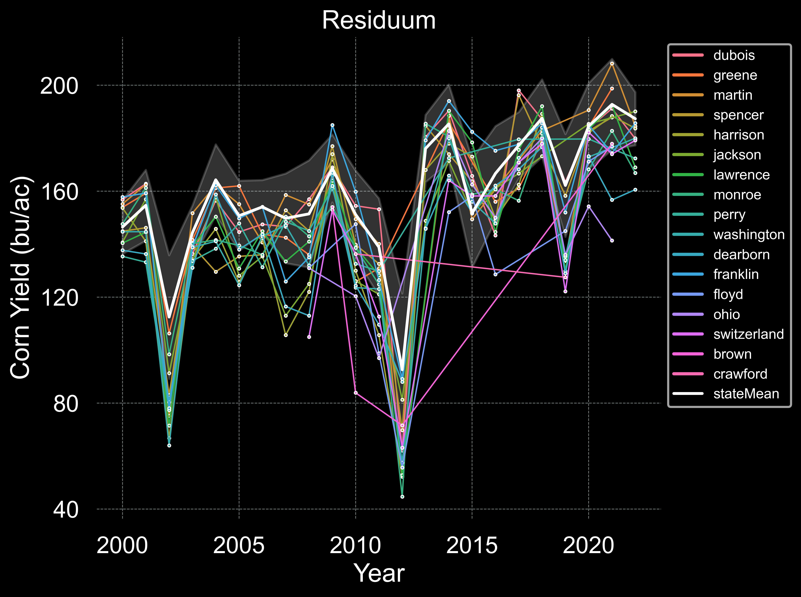

# IndianaDataViewer
The statewide variation of yield and soil in Indiana

This graph plots the difference between the Indiana and county average yields for corn in 2020. The $${\color{red}red \space lines}$$ show the county average lower than the state average, and the $${\color{green}green \space lines}$$ show the counties with higher average yields than the entire state. The interesting aspect of this plot is that the **dominant parent material** of each county is represented by the county colors(refer to the legend). This map is useful for comparing the parent material's effect on Indiana yield over time using the Python code shared in this repo.

