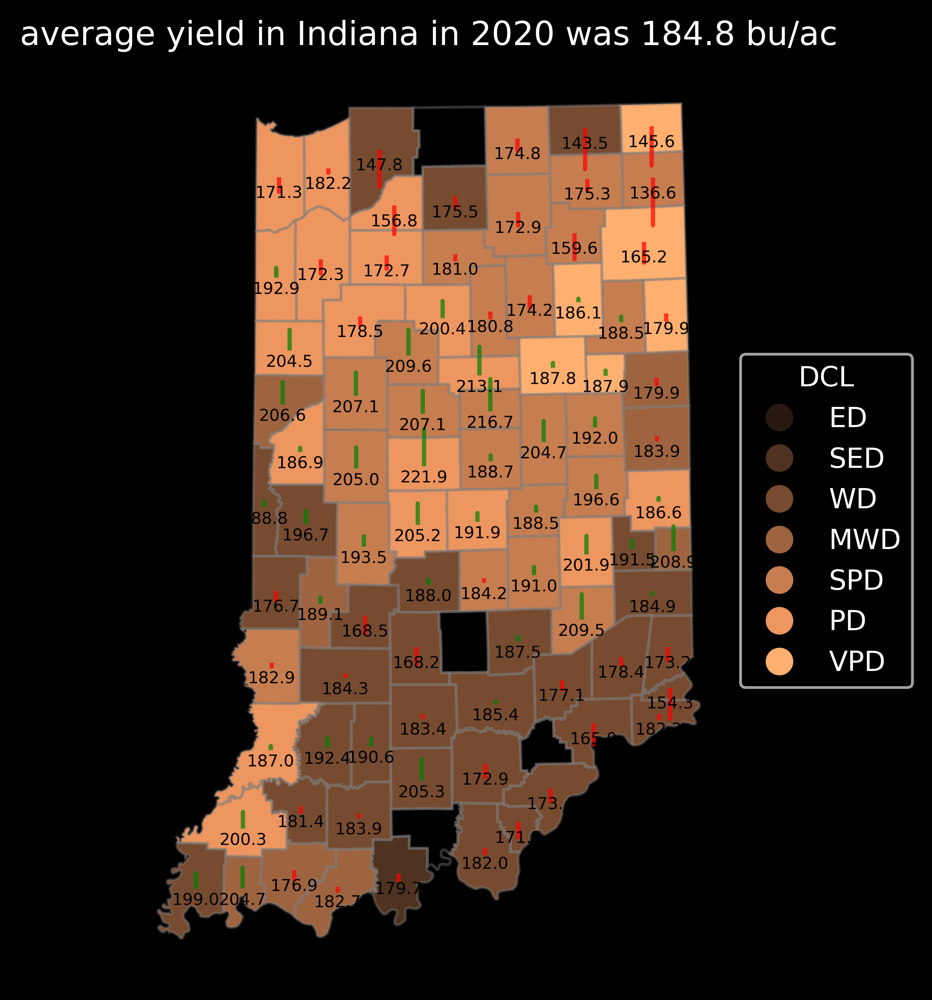

# IndianaDataViewer
The statewide variation of yield and soil in Indiana

This graph plots the difference between the Indiana and county average yields for corn in 2020. The $${\color{red}red \space lines}$$ show the county average lower than the state average, and the $${\color{green}green \space lines}$$ show the counties with higher average yields than the entire state. The interesting aspect of this plot is that the **dominant parent material** of each county is represented by the county colors(refer to the legend). This map is useful for comparing the parent material's effect on Indiana yield over time using the Python code shared in this repo.

A similar figure showing the difference in State and county averages of corn yield in Indiana in 2020 is shown in this figure. Here the base map shows the dominant drainage classes of each county in Indiana.

Another way to visualize the Yield data comparison of each county is by using the line plots. The corn yield difference between counties with different soil taxonomy from 2000 to 2020 is shown in the graphs presented below. An important aspect of the analysis here is the categorization of each soil taxonomy is done using its dominant drainage class. Each figure shows the variation in drainage class Well drained, Moderately Well drained, Somewhat poorly drained, Poorly drained, and Very poorly drained soils. Within each figure, the lines represent the yield obtained from a unique soil taxonomy (dominant soil taxonomy in the county) from 2000 till 2020. 

The interesting fact here is that the effect of the 2012 drought is maximized in well-drained soils.

